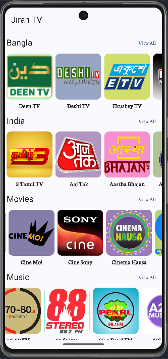
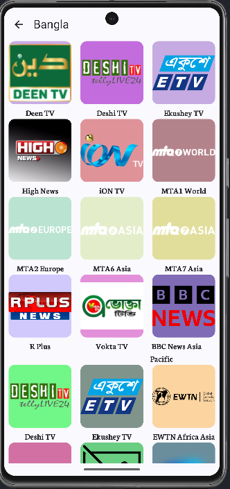
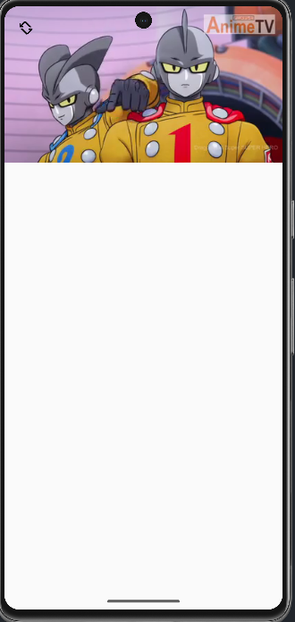
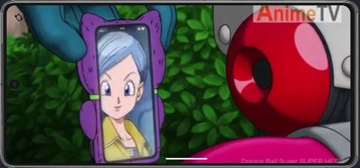

# Jirah-TV

Jirah-TV is a modern IPTV streaming application built with Jetpack Compose, Room, Kotlin, and Material3. Designed with a sleek and user-friendly interface, it allows users to seamlessly explore and stream over 300 channels, organized into categorized lists for ease of access. Powered by ExoPlayer, Jirah-TV supports HLS streams for high-quality playback.

## Features

- **Modern UI**: Developed using Jetpack Compose and Material3 for a polished, responsive, and intuitive design.
- **Room Database**: Store and manage channel details locally for offline use.
- **Kotlin-Powered**: Built entirely in Kotlin for concise and robust code.
- **300+ Channels**: Access a diverse range of live TV channels.
- **Categorized Channel List**: Easily find channels by browsing categories.
- **HLS Stream Support**: Play high-quality video streams using ExoPlayer.
- **ExoPlayer Integration**: Enjoy smooth playback with ExoPlayer's advanced capabilities.

## Tech Stack

- **Programming Language**: Kotlin
- **UI Framework**: Jetpack Compose
- **Database**: Room
- **Material Design**: Material3 components for a modern and consistent UI
- **Media Playback**: ExoPlayer for seamless HLS streaming
- **Dependency Injection**: Koin
- **Networking**: Retrofit with Kotlin Coroutines and Coil
- **Asynchronous Tasks**: Kotlin Coroutines and Flow

## Screenshots






## Getting Started

### Prerequisites
- Android Studio Arctic Fox or later
- Minimum SDK: 21
- Kotlin 1.8.0 or later

### Installation
1. Clone the repository:
   ```bash
   git clone https://github.com/yourusername/jirah-tv.git
